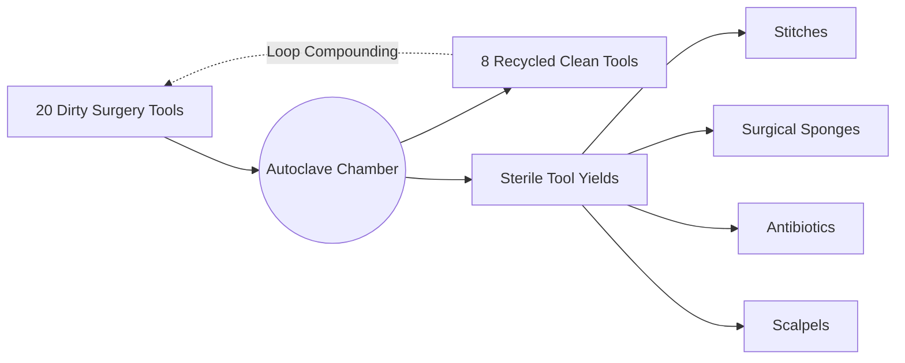

# 🏥 Autoclave Pro — Growtopia Surgery Tool Sterilizer Calculator

<p align="center">
  
  
  
  
  
</p>

<p align="center">
  🌐 <strong>Live Playable Website:</strong><br>
  👉 <a href="https://olyxmintabansos-byte.github.io/Autoclave/" target="_blank"><strong>https://olyxmintabansos-byte.github.io/Autoclave/</strong></a>
</p>

---

> **Simulator Siklus Sterilisasi Alat Bedah (Surgery) Growtopia — Analisis Hasil Panen Stitches, Sponge, Antibiotic, Scalpel, Alat Daur Ulang, Serta Proyeksi Untung/Rugi (WL & DL) Secara Akurat.**

Melakukan sterilisasi *Dirty Surgery Tools* menggunakan mesin **Autoclave** adalah salah satu metode investasi paling populer di Growtopia. Namun tanpa perhitungan matematis yang cermat, pemain berisiko merugi karena fluktuasi harga pasar. **Autoclave Pro** hadir untuk memecahkan masalah ini dengan menyediakan simulator siklus tunggal maupun siklus looping (*compounding*) hingga alat habis.

---

## 📑 Daftar Isi

- [Diagram Siklus Autoclave](#-diagram-siklus-autoclave)
- [Fitur Utama](#-fitur-utama)
- [Rumus & Mekanisme Ekonomi](#-rumus--mekanisme-ekonomi)
- [Struktur File Proyek](#-struktur-file-proyek)
- [Cara Menjalankan Secara Lokal](#-cara-menjalankan-secara-lokal)
- [Lisensi & Atribusi](#-lisensi--atribusi)

---

## 🔄 Diagram Siklus Autoclave



---

## ✨ Fitur Utama

- 🔄 **Dua Mode Kalkulasi:**
  - **Single Run:** Menghitung output dari 1 kali siklus sterilisasi (20 alat kotor $\rightarrow$ hasil item steril + 8 alat kembali).
  - **Full Loop (Until Exhausted):** Mensimulasikan daur ulang berantai otomatis sampai sisa alat kotor $< 20$.
- 💰 **Analisis Ekonomi Mendalam:**
  - Modal Awal (*Total Capital Investment*).
  - Total Pendapatan Kotor (*Gross Revenue* dari seluruh item steril).
  - Keuntungan Bersih (*Net Profit / Loss*) dalam satuan World Lock (WL) dan Diamond Lock (DL).
  - Persentase ROI (*Return on Investment*).
- 🎛️ **Live Market Rate Tuner:** Sesuaikan harga beli alat kotor dan harga jual Stitches, Sponge, Antibiotic, dan Scalpel dengan tombol reset 1-klik.
- 📱 **Modern Dark UI:** Antarmuka bergaya klinik modern bernuansa hijau emerald, dibangun dengan Tailwind CSS dan Lucide Icons yang responsif di HP maupun laptop.

---

## 🧮 Rumus & Mekanisme Ekonomi

Setiap 20 *Dirty Surgery Tools* yang disterilisasi menghasilkan:
$$\text{Returned Tools} = \left\lfloor \frac{\text{Dirty Tools}}{20} \right\rfloor \times 8$$

Pendapatan total dihitung dari rata-rata probabilitas drop item:
$$\text{Total WL Value} = \sum (\text{Item Quantity} \times \text{Item Price in WL})$$
$$\text{Net Profit} = \text{Total WL Value} - \text{Initial Cost (WL)}$$

---

## 📁 Struktur File Proyek

```text
Autoclave/
├── index.html          # Halaman aplikasi kalkulator & Tailwind UI
├── script.js           # Engine simulasi matematika Autoclave & state
├── style.css           # Styling kustom & animasi
└── README.md           # Dokumentasi resmi
```

---

## 🚀 Cara Menjalankan Secara Lokal

1. **Clone repositori:**
   ```bash
   git clone https://github.com/olyxmintabansos-byte/Autoclave.git
   cd Autoclave
   ```
2. **Buka di Browser:**
   Klik ganda `index.html`. Tidak memerlukan instalasi server atau dependensi apa pun!

---

## 📄 Lisensi & Atribusi Hak Cipta

<p align="center">
  
  
</p>

<p align="center">
  Crafted with passion & precision by <strong><a href="https://github.com/olyxmintabansos-byte">Olyx</a></strong><br>
  <strong>© 2026 by Olyx (@olyxmintabansos-byte)</strong>. All rights reserved.<br>
  Dilisensikan di bawah naungan <a href="https://opensource.org/licenses/MIT">MIT License</a>.
</p>
